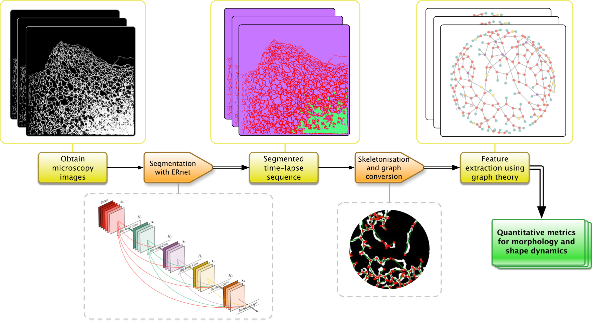

<p>
   </a>
</p>
<br>

<div>
   <a href="https://colab.research.google.com/github/charlesnchr/ERnet-v2/blob/master/ERnet.ipynb"></a>
   <!-- <a href="https://zenodo.org/badge/latestdoi/264818686"></a> -->
</div>

# ERnet Transformer
## Vision Transformer applied to segmentation of endoplasmic reticulum (ER) image sequences
_Meng Lu<sup>1</sup>, __Charles N. Christensen<sup>1,*</sup>__, Jana M. Weber<sup>1,*</sup>, Tasuku Konno, Nino F. Läubli<sup>1</sup>, Katharina M. Scherer<sup>1</sup>, Edward Avezov, Pietro Lio, Alexei A. Lapkin, Gabriele S. Kaminski Schierle<sup>1</sup>, Clemens F. Kaminski<sup>1</sup>_</br></br>
<sup>1</sup>University of Cambridge, Department of Chemical Engineering and Biotechnology</br>
<sup> *</sup>Author of this repository - GitHub username: [charlesnchr](http://github.com/charlesnchr) - Email address: <code>charles.n.chr@gmail.com</code>

Pre-print: [https://www.biorxiv.org/content/10.1101/2022.05.17.492189v1](https://www.biorxiv.org/content/10.1101/2022.05.17.492189v1)

#### Description
ERnet is a vision transformer-based processing pipeline for segmentation and analysis of temporal image sequences of the endoplasmic reticulum. The main component is the vision transformer model used for segmentation, inspired by Swin. Other steps in the pipeline that facilitates quantitative analysis are shown in the figure above.

The method follows our previous work, in which we used a residual neural network for two-class image segmentation, [ERnet — Residual network](https://github.com/charlesnchr/ERNet).

## Try it

Get started right away with our Colab notebooks. If you prefer running the code locally, we provide Jupyter notebooks and Python scripts in this repository. Another option for running ERnet is to use it as a plugin in the graphical front-end, Mambio, based on an integration of the Electron UI framework and a Python environment. Mambio is also included in this repository.

<div align="center">
    <a href="https://colab.research.google.com/github/charlesnchr/ERnet-v2/blob/master/ERnet.ipynb">
        
    </a>
</div>

### Repository structure
The graphical user interface, Mambio, is provided in the folder `Graphical-App`. Instructions and further information can be found in the corresponding README.

Code for training models based on the ERnet architecture can be found in the folder `Training`, and further information is also in the README file of that folder. A script that generates synthetic ER images can be found in `Training/Simulate_ER`, see the [Synthetic data generation pipeline](#synthetic-data-generation-pipeline-for-testing) section.

### Mambio

To run inference with ERnet locally, we provide the graphical user interface Mambio: Multi-purpose Advanced ML-based Batch Image Operations. Mambio is a more general software that extends beyond image segmentation — there is also a plugin for [ML-SIM](https://github.com/charlesnchr/ML-SIM).

<p>
   </a>
</p>
<br>


### Synthetic data generation pipeline for testing

We propose a model for synthesising ground truth ER images with a simple algorithm. First a set of uniformly distributed coordinates are generated. Delaunay triangulation is performed on the coordinates providing a set of triangles. The circumcentre of each triangle becomes a vertex in a Voronoi diagram. The diagram is formed by connecting vertices between adjacent triangles. This procedure is called Voronoi tessellation. Each edge in the undirected graph corresponding to the Voronoi diagram is the perturbed in the following way: the midpoint of an edge is moved in a random direction by a random distance that is smaller than the length of the edge. The displaced midpoint and the two ends of the edge are then used the produce a smooth curve using cubic spline interpolation of the three points. Finally, the network of vertices connected with interpolated curves are processed with a image formation model that applies blur (diffraction) and noise (Poisson noise and Gaussian read-out noise).

<p>
</a>
</p>

The steps of this algorithm are illustrated on the figure above. The implementation can be found in `Training/Simulate_ER`, and the script can be used to generate a collection of test images with
```
python Simulate_ER_images_script.py
```
Parameters are given in the file.

### Preceding work

#### Github repository
[ERNet — Residual network](https://github.com/charlesnchr/ERNet)
<br>
Segmentation of Endoplasmic Reticulum microscopy images using modified CNN-based image restoration models.

#### Science Advances publication
_Meng Lu<sup>1</sup>, Francesca W. van Tartwijk<sup>1</sup>, Julie Qiaojin Lin<sup>1</sup>, Wilco Nijenhuis, Pierre Parutto, Marcus Fantham<sup>1</sup>,  __Charles N. Christensen<sup>1,*</sup>__, Edward  Avezov, Christine E. Holt, Alan Tunnacliffe, David Holcman, Lukas C. Kapitein, Gabriele Kaminski Schierle<sup>1</sup>, Clemens F. Kaminski<sup>1</sup>_</br></br>
<sup>1</sup>University of Cambridge, Department of Chemical Engineering and Biotechnology</br>
<sup> *</sup>Author of this repository - GitHub username: [charlesnchr](http://github.com/charlesnchr)

Pre-print: [https://www.biorxiv.org/content/10.1101/2020.01.15.907444v2](https://www.biorxiv.org/content/10.1101/2020.01.15.907444v2)
<br>
Paper: [https://www.science.org/doi/10.1126/sciadv.abc7209](https://www.science.org/doi/10.1126/sciadv.abc7209)


